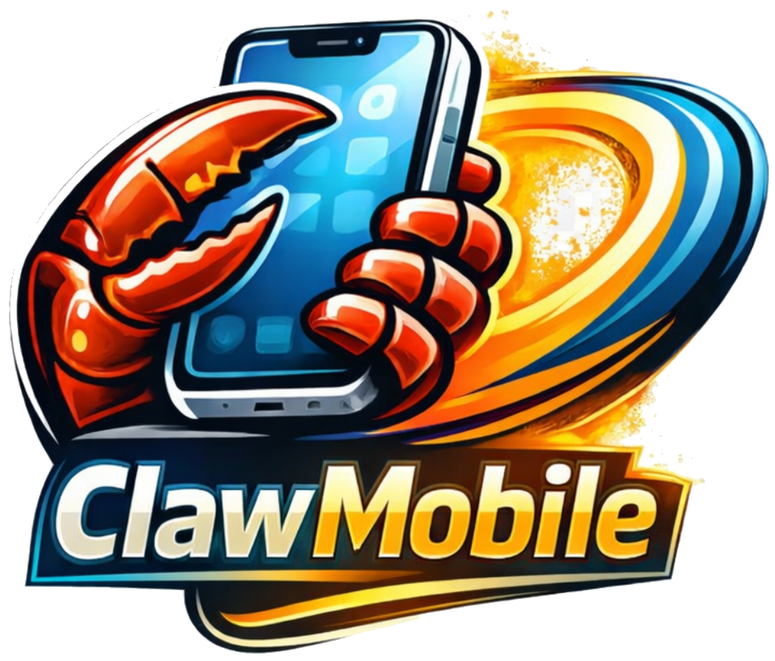
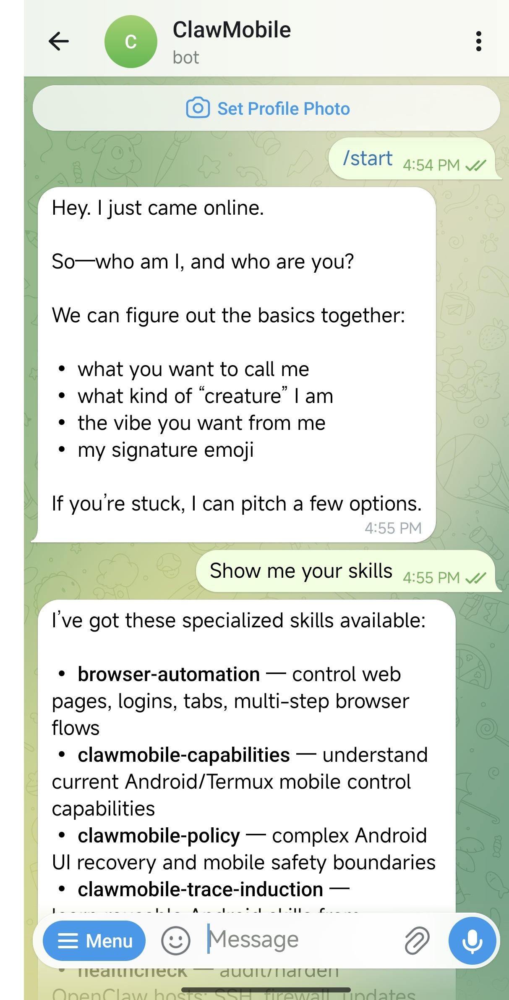
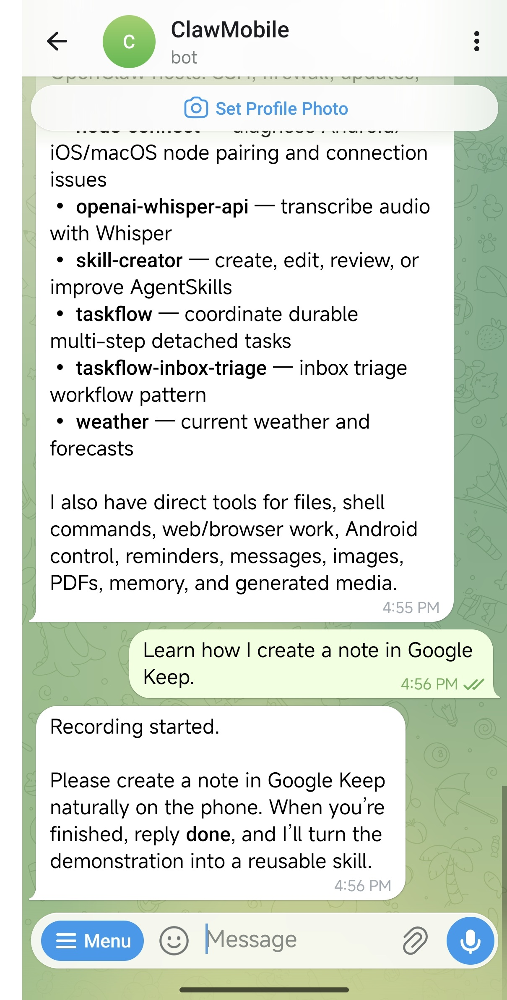
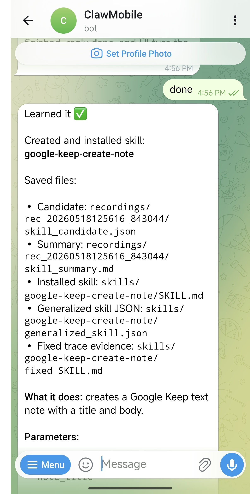

<p align="center">
  
</p>

<p align="center">
  <b>Turn your Android phone into an agent runtime that learns.</b>
</p>

<p align="center">
  <a href="https://clawmobile.ae/">Website</a> ·
  <a href="https://arxiv.org/abs/2602.22942">Paper</a> ·
  <a href="installer/INSTALL.md">Install</a> ·
  <a href="installer/termux-lite/README.md">Termux Runtime</a> ·
  <a href="installer/FAQ.md">FAQ</a> ·
  <a href="SECURITY.md">Security</a> ·
  <a href="CONTRIBUTING.md">Contributing</a> ·
  <a href="https://www.linkedin.com/in/clawmobile-mbzuai/">LinkedIn</a> ·
  <a href="https://www.youtube.com/@ClawMobile-l4x">YouTube</a> ·
  <a href="https://space.bilibili.com/3706946571995651">Bilibili</a>
</p>

<p align="center">
  <a href="LICENSE"></a>
  
  
  
</p>

ClawMobile lets an AI agent live on the Android phone itself. It can talk
through OpenClaw, use local files and shell tools, observe Android state, control
apps when you authorize ADB, and turn your own demonstrations into reusable
skills.

Instead of treating the phone as a remote screen, ClawMobile makes it the
runtime. The phone hosts the gateway, the mobile tools, the recorded evidence,
and the learned workflows, so personal app tasks can become repeatable skills
instead of one-off screenshot reasoning sessions.

## See It In Action

Teach ClawMobile by doing the task once on the phone. It records the
demonstration, turns the trace into a reusable OpenClaw skill, and can run that
skill later from a natural-language request.

<table>
  <tr>
    <td align="center">
      
    </td>
    <td align="center">
      
    </td>
    <td align="center">
      
    </td>
  </tr>
  <tr>
    <td align="center"><strong>Ask what it can do</strong></td>
    <td align="center"><strong>Demonstrate once</strong></td>
    <td align="center"><strong>Reuse as a skill</strong></td>
  </tr>
</table>

<table align="center">
  <tr>
    <td align="center">
      <strong>Generated skill running later</strong><br>
      <video src="https://github.com/user-attachments/assets/7fbeb919-b5fa-48f3-aacb-c64f0132a909" controls width="360"></video>
    </td>
  </tr>
</table>

More demos, including browser, maps, hardware, and script workflows, are in
[the demo gallery](docs/demos.md).

## Why ClawMobile?

Most mobile-agent systems treat the phone as a screen to be remote-controlled.
ClawMobile treats the phone as the runtime.

| Capability | Why it matters |
| --- | --- |
| **Local agent runtime** | The agent runs where the apps, files, notifications, and Android state already live. |
| **Phone-native tool surface** | Use shell commands, files, network access, OCR, screenshots, UIAutomator XML, app/window state, and touch input from one OpenClaw surface. |
| **Progressive permissions** | Start with Termux tools, then unlock Termux:API and ADB-backed UI control when the user chooses. |
| **Learned mobile skills** | Record a task once, generate an OpenClaw skill, and improve it with more demos or execution feedback. |

## What You Can Build

- A phone-side OpenClaw gateway reachable from Telegram or other channels.
- A personal mobile assistant that can use local files, shell tools, network
  commands, and device context.
- App-specific workflows learned from your own demonstrations instead of
  handwritten automation scripts.
- Research prototypes for smartphone-native agents with a lightweight local
  runtime.
- Reusable mobile skills that carry their own evidence, grounding policy, and
  feedback history.
- A practical bridge between language-agent reasoning and deterministic Android
  actions.

## Quick Start

From a fresh Termux install:

```bash
# Install ClawMobile with the guided quick setup and start the gateway
curl -fsSL https://raw.githubusercontent.com/ClawMobile/ClawMobile/main/installer/termux-lite/bootstrap.sh | bash -s -- --quick --start
```

From an existing repository checkout:

```bash
./installer/termux-lite/clawmobile setup --quick --start
```

Omit `--start` if you want setup to finish before launching the long-running
OpenClaw gateway.

Quick setup will ask for a model provider/API key and, optionally, Telegram
bot details so you can message the phone from another device. If those terms
are unfamiliar, see the FAQ before starting.

More setup paths:

- [Termux runtime guide](installer/termux-lite/README.md)
- [Installation guide](installer/INSTALL.md)
- [FAQ](installer/FAQ.md)

## Try These First

After the gateway starts, send one of these requests through your configured
channel:

```text
What can you do on this phone?
```

```text
What phone capabilities are available right now?
```

```text
What app or screen is open on the phone right now?
```

## What Can It Do?

ClawMobile runs at different capability levels depending on what the user has
enabled.

| Stage | Enabled by | Example capabilities |
| --- | --- | --- |
| **Termux** | Default runtime | OpenClaw gateway, shell tools, files, network, local OCR |
| **Termux:API** | Termux:API app and package | Clipboard, notifications, battery, text-to-speech |
| **ADB shell** | Authorized `adb devices` connection | Taps, swipes, typing, screenshots, UIAutomator XML, Android shell commands |

The Termux stage is already useful for local tools and network tasks. Once ADB
is authorized, the same runtime gains UI automation and demonstration recording.

## How Skill Learning Works

The demo above shows the user experience. Under the hood, ClawMobile turns a
one-time phone demonstration into a reusable workflow:

1. Record the task as the user performs it.
2. Capture touch events, screenshots, app state, and UI evidence.
3. Generate a parameterized skill candidate.
4. Promote the candidate into the OpenClaw workspace.
5. Reuse it, test it, and improve it with feedback or another demo.

The goal is not to hard-code every app. It is to give the agent durable local
evidence: what the user did, what screen state mattered, what values should be
parameters, and where recovery may be needed. Over time, generated skills can
accumulate execution feedback and additional demonstrations instead of relying
only on one-off screenshot reasoning.

This is especially useful for mobile apps where pure screenshot-based agents can
mis-click, lose context, or repeat expensive verification loops.

Generated skills are a **public-preview** capability. The core flow can record a
demo, generate a reusable skill, promote it into the OpenClaw workspace, and use
later execution feedback as attached evidence. Reliability improves with
additional demonstrations, cleaner starting app states, and feedback from real
executions. Fast paths and batch execution are experimental accelerators for
stable generated-skill steps, not a replacement for normal recovery.

## Runtime Architecture

| Layer | Role |
| --- | --- |
| User channel | Telegram or another OpenClaw-supported interface. |
| OpenClaw gateway on Android | The local agent runtime running on the phone. |
| ClawMobile workspace | Policies, capability contracts, and reusable skills. |
| `mobile-ui` plugin | Tool bridge between OpenClaw and mobile backends. |
| Mobile backends | Termux tools, Termux:API, ADB/Android shell, OCR, and generated skill storage. |
| Android apps and device state | The real mobile environment the agent observes and acts on. |

The important design choice is progressive capability. The same agent can run
with only Termux permissions, then use richer phone-control tools when the user
authorizes them.

## Project Status

ClawMobile is in public preview for real Android devices. The default Termux
runtime includes the installer, OpenClaw mobile plugin, OCR support,
ADB-backed UI tools, and the trace-to-skill workflow.

Generated skills are useful today, but they are still preview software. They
work best on the same device, app version, and starting state used for the
demonstration. Reliability improves with additional demos and execution
feedback, and fast paths may fall back to normal UI recovery when a workflow is
not stable enough.

The older DroidRun/MobileRun backend remains available as an advanced research
path for Accessibility-backed and code-generated UI execution.

## Privacy And Safety

ClawMobile runs locally on the phone, but some artifacts can contain sensitive
information:

- Model API keys are stored in the local OpenClaw configuration when you choose
  to save them during setup.
- Demonstration recordings may include screenshots, touch coordinates, app
  package/activity names, text entry traces, and device state.
- Generated skills may preserve evidence paths and summaries from those
  recordings.
- ADB authorization gives ClawMobile strong control over the device UI and
  Android shell.

Keep `logs/`, `recordings/`, token-proxy captures, and generated test artifacts
out of public commits unless you have reviewed them first.

## Known Limitations

- ADB-backed UI control requires Android developer options, USB or wireless ADB,
  and an authorized device connection.
- Termux package mirrors can occasionally be stale or unreachable; the
  installer includes mirror fallback logic, but network conditions still matter.
- Generated skills are a preview feature. They start from recorded evidence and
  are useful immediately for repeatable workflows, but become more robust after
  additional demonstrations and execution feedback.
- Generated skills should first be tested on the same device, app version, and
  starting app state used for the demo. Cross-device, cross-layout, and dynamic
  list workflows may require additional demonstrations.
- Screenshot-heavy verification can be slower on phone hardware than on desktop;
  deterministic fast paths for stable generated-skill actions are still
  experimental accelerators.

## Runtime Backends

| Runtime | Status | Best for |
| --- | --- | --- |
| **ClawMobile default Termux runtime** | Recommended public path | Termux-first setup, local OpenClaw gateway, mobile tools, ADB UI control, OCR, learned skills |
| **Full DroidRun/MobileRun backend** | Advanced / experimental | Ubuntu/proot setup, DroidRun Portal, Accessibility-backed control, code-generated multi-step UI execution experiments |

The default Termux runtime is the public starting point because it is easier to
install, easier to debug, and aligned with generated skills. The full backend is
still valuable for research into faster UI execution.

## Repository Map

- `openclaw-plugin-mobile-ui/`
  Mobile runtime plugin, Android/Termux/ADB/OCR tools, recorder, trace parser,
  generated-skill pipeline, and Termux runtime batch fast path.

- `installer/termux-lite/`
  Recommended public Termux runtime installer and scripts.

- `installer/workspace-seed-lite/`
  Default OpenClaw workspace seed, policies, and trace-induction skills.

- `installer/termux/`, `installer/ubuntu/`, `installer/workspace-seed/`
  Legacy/full DroidRun path for advanced backend experiments. See
  [installer/FULL_BACKEND.md](installer/FULL_BACKEND.md).

## Where To Go Next

- Install ClawMobile: [installer/INSTALL.md](installer/INSTALL.md)
- Understand the Termux runtime: [installer/termux-lite/README.md](installer/termux-lite/README.md)
- Troubleshoot setup: [installer/FAQ.md](installer/FAQ.md)
- Advanced full backend: [installer/FULL_BACKEND.md](installer/FULL_BACKEND.md)
- Report issues safely: [SECURITY.md](SECURITY.md)
- Contribute fixes or skills: [CONTRIBUTING.md](CONTRIBUTING.md)
- Follow public changes: [CHANGELOG.md](CHANGELOG.md)
- Read the paper: https://arxiv.org/abs/2602.22942

## Citation

```bibtex
@misc{du2026clawmobile,
  title        = {ClawMobile: Rethinking Smartphone-Native Agentic Systems},
  author       = {Du, Hongchao and Wu, Shangyu and Li, Qiao and Pan, Riwei and Li, Jinheng and Sun, Youcheng and Xue, Chun Jason},
  year         = {2026},
  eprint       = {2602.22942},
  archivePrefix= {arXiv},
  primaryClass = {cs.MA},
  doi          = {10.48550/arXiv.2602.22942}
}
```
